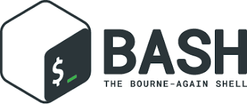

# <a name="top">CWN Bash/Shell Library</a> 

<table style="width: 300px; float: left;" border="0" cellspacing="0">
<tbody>
  <tr>
    <td>
      
  
</td>
    <td>CWN has created a project supporting Bash scripting that can help automate job functions.  Our intention is to collaborate withthe community and provide useful resources for engineers and developers.</td>
 </tr>
</tbody>
</table>

## Public domain

This project is in the public domain within the United States, and
copyright and related rights in the work worldwide are waived through
the [CC0 1.0 Universal public domain dedication](https://creativecommons.org/publicdomain/zero/1.0/).

All contributions to this project will be released under the CC0
dedication. By submitting a pull request, you are agreeing to comply
with this waiver of copyright interest.