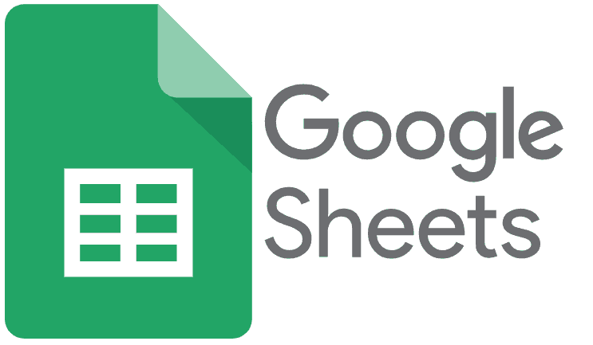

# <a name="top">CWN Google Appscript Google Sheet Library</a> 

<table style="width: 300px; float: left;" border="0" cellspacing="0">
<tbody>
  <tr>
    <td>
      
  
</td>
    <td>CWN has created a project supporting Google Appscript modules designed to support Google Sheets and help the Google community with quick modules that can save time and add effiencies to teams and individuals using Google Sheets.</td>
 </tr>
</tbody>
</table>

## Table of Contents

- [Repository contents](#repository-contents)
- [Usage](#usage)

[top](#top)

## Repository contents

Please see the [Google Sheet](https://docs.google.com/spreadsheets/d/1F_uhD4xFrUvJz38mkVfs90m-3nAfeSe17zF_rXk3DNw/edit#gid=0) that has working samples of these projects.  

| Name of Module | Description | 
| :-------- | :----------- | 
| [**columindexbynameandrow.gs**](https://github.com/cwnit/toolkits/blob/master/collections/googleappscript/google_sheets/columindexbynameandrow.gs) | Allow a user to search Google sheet column by name.     *__Limits:__* Variable mysheetname must be a appscript sheet object.    Variable rs must be set to 1 if no specific row is required.      *__Input:__* "  colname:  the name of the column your searching for, this is case sensative.  Example "Variable 2"    mysheet:  must be a spreadsheet object (the source) that you will be searching in.  Example var ss = SpreadsheetApp.getActiveSpreadsheet();   rs:  row number where the search will start, always use default of one if you don't know where to start.  example 1      *__Result:__*  3 this identifies the column number where the column name lives. |
| [**matchmytext.gs**](https://github.com/cwnit/toolkits/blob/master/collections/googleappscript/google_sheets/matchtext.gs) | The function searches for text within a string that is provided. The search matches text that is provided through the use of an index.  Natively Google Appscript has this ability with their function indexOf.  The simple function also accounts for simple error handling which makes it readily usable.     *__Limits:__*  Supports strings, numbers must be converted into strings first      *__Input:__* "helloworld" is the variable you want to search and "hello is the key you are searching for"      *__Result:__*  0 since hello is found.  If not found result would be -1 indicating no match | 
| [**getweeknumber.gs**](https://github.com/cwnit/toolkits/blob/master/collections/googleappscript/google_sheets/getweeknumber.gs) | The function returns a number based on a date provided.  The number is based on a standard calender year comprised of 52 weeks.      *__Limits:__*  Appsript Now() function is not supported      *__Input:__* 10/26/2020 18:42:00     *__Result:__* 44 |
| [**subdaysfromdate.gs**](https://github.com/cwnit/toolkits/blob/master/collections/googleappscript/google_sheets/subdaysfromdate.gs) | The function subtracts days from a specified start date.  The date must be in a valid Google format see Appscript develoepr reference for date formatting      *__Limits:__*  variable d must be an integer and date must be an actual date format and not a string.     *__Input:__* date = 11/5/2020, d = 5     *__Result:__* 10/31/2020 |
| [**adddaysfromdate.gs**](https://github.com/cwnit/toolkits/blob/master/collections/googleappscript/google_sheets/adddaysfromdate.gs) | The function adds days to a specified start date.  The date must be in a valid Google format see Appscript develoepr reference for date formatting      *__Limits:__*  variable d must be an integer and date must be an actual date format and not a string.     *__Input:__* date = 5/8/2013, d = 4     *__Result:__* 5/12/2013|
| [**languagetranslate.gs**](https://github.com/cwnit/toolkits/blob/master/collections/googleappscript/google_sheets/languagetranslate.gs) | The function takes a string and translate it from the language provided into the language required.       *__Limits:__*  Developers must specifiy the to and from language.  Reference [Google language support for more information](https://cloud.google.com/translate/docs/languages).     *__Input:__* strtext = "Translate me", fromLang = "en", toLang = "es"     *__Result:__* "Traduceme" |

[top](#top)

# Usage
Googlescript requires a foundational understanding of Javascript.  For those of you just getting started please visit this free tutorial that walks you through Javascript basics.

## Developer Information ##
| Material description | URL |
| ---------- | ------------ |
| Javascript basics | [Link](https://www.w3schools.com/js/DEFAULT.asp) |
| Appscript developer reference | [Link](https://developers.google.com/apps-script/reference/) |
| Appscript developer guides | [Link](https://developers.google.com/google-ads/scripts/docs/your-first-script) |

[top](#top)
