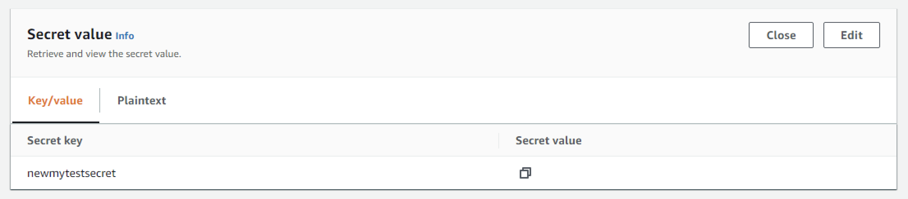
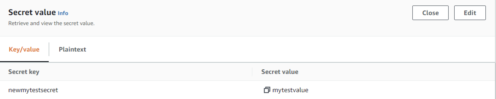
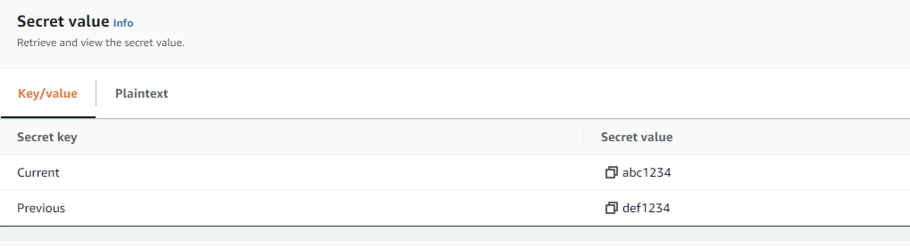

# <a name="top">CWN AWS Powershell Library</a> 

<table style="width: 300px; float: left;" border="0" cellspacing="0">
<tbody>
  <tr>
    <td>
      
  
</td>
    <td>CWN has created a project supporting AWS Powershell modules that can help automate AWS functions.</td>
 </tr>
</tbody>
</table>

## Table of Contents

- [Repository contents](#repository-contents)
- [Usage](#usage)

[top](#top)

## Repository contents
<table border="0" cellspacing="0">
<tbody>
<tr>
<td align="top" width="25%"><strong>Name of Module</strong></td>
<td align="top" width="75%"><strong>Usage</strong></td>
</tr>
<tr VALIGN=TOP>
  <td> 
    <a href="https://github.com/cwnit/toolkits/blob/master/collections/powershell/aws/s3objectdownload.ps1">s3objectdownload.ps1</a>  
    The script is used to download S3 files from a target S3 bucket to a windows machine into the users download directory.  The script assumes that this is interactive and users can provide AWS Credentials to the script.
  </td>
  <td>
  
<em><strong>Limits:</strong></em> Script requires that users provide necessary AWS Access Key and AWS Secret Keys in order for the script to run. Keys should have the necessary permissions to access S3 bucket.  It also assumes that Powershell is allowed to run on the machine and that AWS Powershell module is installed on the machine where the script is being run.
 
  
<em><strong>Input:</strong></em>&nbsp; The script requires variables to be set in order to run appropriately.  The following are variables that need to be updated in order to run the script:

  $accessKey = AWS Access Key for the account where its being executed.
  
  $secretKey = AWS Secret Key for the account where its being executed.

  $region = "us-east-1" #this is te default change based on respective region.

  $bucket = "Name of the bucket you are connecting to."

  $file = "The file you wish to download."

  It should be understood that the $username will capture the local logged on user. 

  
<em><strong>Result:</strong></em>&nbsp;The target file will be downloaded in the users Download directory.  This is done intentionally to ensure permissions are allowed in the event the operating system is restricted.

  </td>
</tr>

<tr VALIGN=TOP>
  <td> 
    <a href="https://github.com/cwnit/toolkits/blob/master/collections/powershell/aws/s3objectupload.ps1">s3objectupload.ps1</a>  
    The script allows users to upload files into AWS S3 Bucket from a windows machine using Powershell.  The script assumes that there is an interactive login to execute the script.
  </td>
  <td>
  
<em><strong>Limits:</strong></em> Script requires that users provide necessary AWS Access Key and AWS Secret Keys in order for the script to run. Keys should have the necessary permissions to access S3 bucket.  It also assumes that Powershell is allowed to run on the machine and that AWS Powershell module is installed on the machine where the script is being run.  Note that the script assumes that target file will be within the download directory.
 

  
<em><strong>Input:</strong></em>&nbsp;" The script requires variables to be set in order to run appropriately.  The following are variables that need to be updated in order to run the script:

  $accessKey = AWS Access Key for the account where its being executed.
    
  $secretKey = AWS Secret Key for the account where its being executed.

  $region = "us-east-1" #this is te default change based on respective region.

  $bucket = "Name of the bucket you are connecting to."

  $file = "The file you wish to upload."

  It should be understood that the $username will capture the local logged on user.
 
  
<em><strong>Result:</strong></em>&nbsp;The target file will be Uploaded, we suggest you in the users Download directory.  This is done intentionally to ensure permissions are allowed in the event the operating system is restricted.

</tr>
<tr VALIGN=TOP>
  <td> 
    <a href="https://github.com/cwnit/toolkits/blob/master/collections/powershell/aws/singlesecretsmgr.ps1">singlesecretsmgr.ps1</a>  
    
  
 
    The script allows users to use powershell to retrieve a single secret value from secrets manager.  Note that this is for a single value and not a key / value pair.
  </td>
  <td>
  
<em><strong>Limits:</strong></em> The script assumes that the user running it has the necessary policies to read the secrets.  The assumption is also that the user has configured their AWS Keys on the system. 
 

  
<em><strong>Input:</strong></em>&nbsp;" Users of the script will need to set the follow variables to execute script:
  
  $sm_value = The name of the secret you are trying to access.
 
  
  
<em><strong>Result:</strong></em>&nbsp;The script output will create a variable that is a securestring to be reused.

</tr>
<tr VALIGN=TOP>
  <td> 
    <a href="https://github.com/cwnit/toolkits/blob/master/collections/powershell/aws/keyvaluesecret.ps1">keyvaluesecret.ps1</a> 
    
  
  
    The script allows users to use powershell to retrieve a key / value secret from AWS Secrets Manager. It creates an array that can be used to select the value from the key / value.
  
  </td>
  <td>
  
<em><strong>Limits:</strong></em> The script assumes that the user running it has the necessary policies to read the secrets.  The assumption is also that the user has configured their AWS Keys on the system.  See example policy provided in the ps1.
 

  
<em><strong>Input:</strong></em>&nbsp;" Users of the script will need to set the follow variables to execute script:
  
  $sm_value = The name of the secret you are trying to access.
 
  
  As part of the key value secret you need to ensure that you change the array value as shown in the script example.  

  
<em><strong>Result:</strong></em>&nbsp;The script output will create a variable that is a securestring to be reused.

</tr>
<tr VALIGN=TOP>
  <td> 
    <a href="">multi-keyvalue-secret.ps1</a> 
    
  
  
    The script allows users to use powershell to retrieve a multi value key / value secret from AWS Secrets Manager. It creates an array that can be used to select the value from the key / value.
  
  </td>
  <td>
  
<em><strong>Limits:</strong></em> The script assumes that the user running it has the necessary policies to read the secrets.  The assumption is also that the user has configured their AWS Keys on the system.  See example policy provided in the ps1.
 

  
<em><strong>Input:</strong></em>&nbsp;" Users of the script will need to set the follow variables to execute script:
  
  $sm_value = The name of the secret you are trying to access.
 
  
  As part of the key value secret you need to ensure that you change the array value as shown in the script example.  

  
<em><strong>Result:</strong></em>&nbsp;The script output will create a variable that is a securestring to be reused.

</tr>

</tbody>
</table>

## Usage
PowerShell 

*Source:  [Microsoft.com](https://docs.microsoft.com/en-us/powershell/scripting/overview?view=powershell-7.2)*

## Developer Information ##
| Material description | URL |
| ---------- | ------------ |
| Powershell AWS Cmdlet | [Link](https://docs.aws.amazon.com/powershell/latest/reference/index.html) |
| Powershell developer reference | [Link](https://devblogs.microsoft.com/scripting/table-of-basic-powershell-commands/) |
| Powershell AWS Tools Documentation | [Link](https://docs.aws.amazon.com/powershell/) |

[top](#top)
